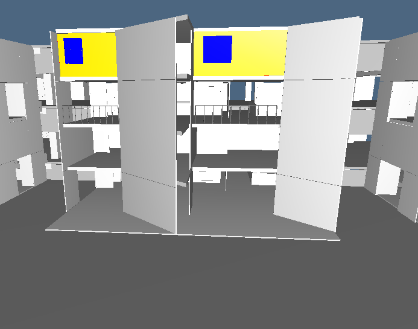

[Salk Institute](https://it.wikipedia.org/wiki/Salk_Institute_for_Biological_Studies)
 

Il Salk Institute for Biological Studies sorge a La Jolla, California in riva all'Oceano Pacifico. Commissionato nel 1959 dal Jonas Salk all'architetto di origini ebraiche, Louis I. Kahn, l'edificio si avvale di un suggestivo posizionamento su una scogliera lambita dall'oceano, su cui Kahn ha costruito uno degli edifici più importanti del XX secolo.

L'istituto vanta un vasto cortile interno che evoca la maestosità di una cattedrale, cortile che inizialmente Kahn aveva pensato alberato, ma che poi, su consiglio dell'architetto messicano Luis Barragan[1] progettò spoglio, rivestito in travertino, tagliato in lunghezza da un sottile canale d'acqua che attraversa il cortile per gettarsi in una serie di vasche sottostanti. Scelta azzecata perché al visitatore suscita un sentimento di spazio assoluto, senza tempo, molto affascinante per chiunque scelga di sostare in tutta tranquillità in questo spazio. Le proporzioni del cortile esterno - la sua orizzontalità in contrasto con la verticalità delle adiacenti Study Towers - determinano un equilibrio che si potrebbe definire atemporale. Le Study Towers si elevano simmetriche ai lati del cortile, con muri ad angoli di 45° che offrono scorci spettacolari.

Questi elementi verticali adibiti ad uffici/studi per i ricercatori del laboratorio, sono collegati agli edifici che ospitano i laboratori, e demarcano il confine del vasto complesso. Con getti di calcestruzzo in opera dentro casseformi accuratamente predisposte, sono state realizzate eleganti superfici, a cui in alcuni punti, come appunto per le Study Towers, sono stati affiancati pannelli di legno Teak.

Panorama a 360°del cortile del Salk Institute
Nel 1959 Jonas Salk era alla ricerca di un architetto che progettasse un nuovo edificio per studi biologici a San Diego. Un amico di Salk assisté ad una conferenza di Louis Kahn, e pensò che le idee dell'architetto sarebbero potute piacere a Salk. Quando si conobbero, Kahn e Salk si resero conto di avere interessi simili e l'architetto ottenne l'incarico. Il committente non decise o stilò delle direttive, ma lasciò praticamente carta bianca a Kahn, che di pari passo alla costruzione, continuò la conversazione con Salk, i due trovarono una perfetta sintonia sui metodi e sulla forma dell'edificio. Questo contribuì alla nascita di una stupenda costruzione, adatta allo scopo e voluta fortemente da entrambi.

 

 
