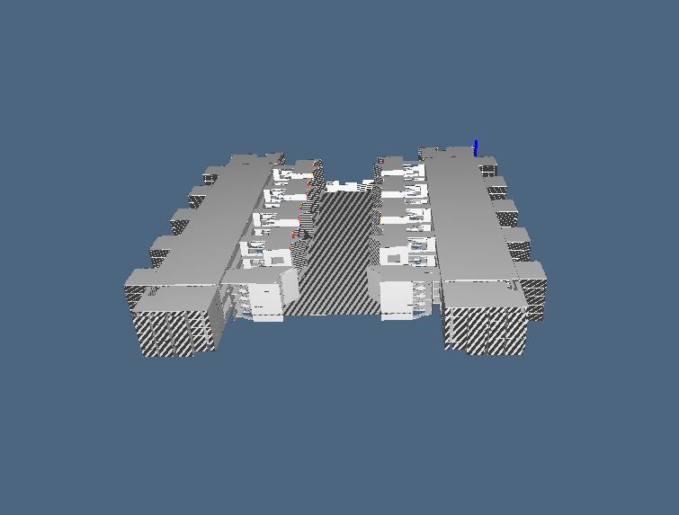

Salk Institute

Il Salk Institute for Biological Studies sorge a La Jolla, California in riva all'Oceano Pacifico. 

L'istituto vanta un vasto cortile interno che evoca la maestosità di una cattedrale, rivestito in travertino, tagliato in lunghezza da un sottile canale d'acqua che attraversa il cortile per gettarsi in una serie di vasche sottostanti.

 
